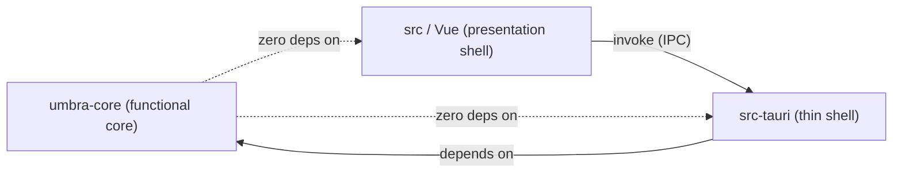
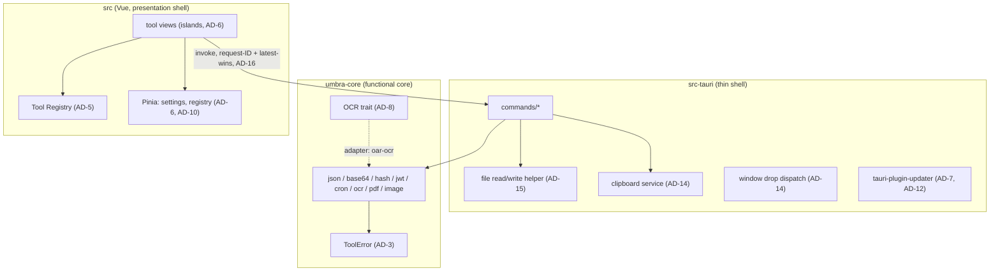

# Architecture Spine — Umbra

> Reconstructed 2026-07-20 after the original spine (authored 2026-07-19) was destroyed in a data-loss incident — an unforced `create-tauri-app --force` run emptied the repo root before scaffolding. No pre-incident git history survives. This spine is rebuilt from the PRD, `epics.md` (which had already absorbed the original spine's decisions into its story acceptance criteria), and the one surviving story file — all three cited as `sources` above. `AD` numbering is preserved from those citations; no `AD` was renumbered or reused. A Reviewer Gate (3 reconciliation checks + a rubric walker + version-verification and adversarial-divergence lenses, all independent parallel passes) ran before this spine closed; version corrections (Pinia, Vue Router) and structural clarifications (`ToolError.position` encoding, epoch-timestamp units, drop-declaration schema, CI convention completeness) came out of that gate. Every Stack table version below is confirmed against the crates.io/npm registry APIs directly (not a search-engine snippet, which proved unreliable once — see the memlog for the `oar-ocr` correction-of-a-correction). See the memlog for the full trail.

## Design Paradigm

**Functional core, thin shell** (Bernhardt pattern), mapped to three layers:

- **Functional core — `crates/umbra-core`.** Pure transformations only: no I/O, no Tauri dependency, no platform branches. Every tool's logic (JSON, Base64, hash, JWT, cron, OCR, PDF, image) lives here as testable functions/traits returning machine values.
- **Thin shell — `src-tauri`.** The only place that touches the OS: files, clipboard, drops, window, updater, notarization surface. Exposes core via async commands; owns nothing that could instead be a pure function.
- **Presentation shell — `src` (Vue).** Renders core's machine values (epoch timestamps, structured errors) into locale-aware, human-facing UI. Owns Pinia stores for state that must cross tool boundaries.



## Invariants & Rules

### AD-1 — Functional core owns every transformation

- **Binds:** all tool logic (`umbra-core`)
- **Prevents:** business logic leaking into `src-tauri` or Vue, where it cannot be unit-tested once or reused across platforms
- **Rule:** every transformation is a pure function in `umbra-core`. Presentation formatting — locale/timezone rendering, case toggles for display — is view-owned, never computed in core. Core returns machine values (epoch integers, raw structured data); the view renders them for humans. `[ADOPTED]`

### AD-2 — Core is dependency-clean

- **Binds:** `umbra-core` crate
- **Prevents:** a macOS-only dependency or platform branch silently breaking the NFR3 cross-platform-clean promise
- **Rule:** `umbra-core` imports no `tauri`/`tauri-*` crate and contains zero `#[cfg(target_os)]` branches. CI enforces this on every PR (AD-11). `[ADOPTED]`

### AD-3 — One error shape for every command

- **Binds:** every Tauri command
- **Prevents:** each tool inventing its own error shape, forcing the view to string-match messages to render them
- **Rule:** a single `ToolError` struct — `{ code: <stable kebab-case string>, message: String, position: Option<Position>, context: Option<String> }` — defined once in `umbra-core`, is the only error type every command returns as `Result<T, ToolError>`. `Position` is an internally-tagged enum (`#[serde(tag = "kind")]`) with two variants, `LineCol { line: u32, column: u32 }` and `ByteOffset(u64)` — not a pseudo-union type. Commands are named `<tool>_<verb>`. The view renders errors from `ToolError`'s structure only — never by parsing `message` text. `[ADOPTED]`

### AD-4 — Heavy work stays off the UI thread and off the launch path

- **Binds:** any tool operation
- **Prevents:** the UI freezing on large inputs, or a heavy first-use cost landing on cold launch
- **Rule:** work that can exceed ~100ms CPU runs async on the Rust blocking thread pool. Large result sets render through virtualized views. Heavy resources (the OCR session) initialize lazily on first use, never at launch. `[ADOPTED]`

### AD-5 — One Tool Registry is the only source of tool metadata

- **Binds:** sidebar, command palette, routing
- **Prevents:** tool metadata (name, alias, icon, route) drifting across three separately maintained lists
- **Rule:** one Tool Registry entry — `{ id, name, aliases, route, icon, drop declarations, shortcut declarations }` — is the single source that generates the sidebar, the palette index, and the route table. Nothing else enumerates tools. `[ADOPTED]`

### AD-6 — Tools are islands

- **Binds:** cross-tool state
- **Prevents:** tools coupling to each other, making any single tool impossible to add, remove, or reason about independently
- **Rule:** no tool reads another tool's state. Cross-cutting state lives only in the Pinia stores `settings` and `registry`. `[ADOPTED]`

### AD-7 — Zero network surface except the updater

- **Binds:** the whole app, per PRD INV-1 and INV-2
- **Prevents:** an untracked network call breaking the local-only promise that is the product's entire identity
- **Rule:** zero network surface except `tauri-plugin-updater`. No dependency whose purpose is network I/O exists anywhere in the tree. Webview capabilities grant no network scope. OCR models ship bundled as app resources with `oar-ocr`'s auto-download explicitly disabled. The updater carve-out is disclosed in both README and in-app (never just one). `[ADOPTED]`

### AD-8 — OCR (and future local inference) sits behind a core-owned trait

- **Binds:** OCR (Epic 4), the second AI feature (Epic 6)
- **Prevents:** an inference library leaking through the whole call stack instead of sitting behind a swappable seam
- **Rule:** `umbra-core` owns an OCR-shaped trait — recognized text + confidence out, honest empty/failure states, accepting image input either as compressed bytes (format-sniffed) or as already-decoded raw RGBA pixels plus dimensions. `oar-ocr` is the v1 adapter behind it. Commands and UI depend on the trait only, never on the adapter crate directly. `[ADOPTED]` *(Amended 2026-08-06, Story 4.2 — the raw-RGBA input path was added because clipboard-pasted images arrive from the OS already decoded, with no compressed-bytes accessor; the rule's original "image bytes in" wording predated that finding and read narrower than what the trait now honestly accepts. See that story's Dev Notes.)*

### AD-9 — NL→cron never ships an unverified guess

- **Binds:** the natural-language↔cron tool (Epic 3)
- **Prevents:** a confident-sounding but wrong cron expression reaching the user (the PRD's explicit AI-honesty bar, FR21)
- **Rule:** every NL→cron result round-trips through the cron→English direction before display; only a consistent round-trip is shown. The canonical phrase corpus (must-convert + must-honestly-fail sets) runs as an automated test in `umbra-core`; a corpus regression fails the build. `[ADOPTED]`

### AD-10 — One persistence mechanism, one writer

- **Binds:** all persisted state
- **Prevents:** two writers racing on `settings.json`, or persistence sprawling into an undiscoverable set of files
- **Rule:** the only persistence mechanism is `tauri-plugin-store` writing one `settings.json`. The frontend `settings` Pinia store is its single writer — Rust-side code never writes it. Keys are namespaced `shell.*` / `<tool-id>.*`. The Settings pane enumerates every persisted key with a one-action clear (PRD INV-3). Window geometry is captured frontend-side on debounced move/resize. `[ADOPTED]`

### AD-11 — CI proves cross-platform cleanliness on every PR

- **Binds:** CI
- **Prevents:** a platform-specific dependency or regression merging unnoticed because CI only proves the codebase against one operating system. This must not depend on which platform any given contributor happens to develop on — that is not guaranteed to stay constant over the project's lifetime.
- **Rule:** checks split by whether they compile/execute code (and can therefore differ per OS via `#[cfg(target_os)]`) or only read source text (and structurally cannot). `cargo check`, clippy, and `cargo test --workspace` run on `ubuntu-latest`, `windows-latest`, and `macos-latest` — all three, as required status checks — because `src-tauri` (unlike `umbra-core`) is allowed OS-specific code, and only the compiling/executing checks can catch a regression gated to one platform. `cargo fmt --check`, `pnpm lint` (eslint), and `pnpm test` (Vitest) run once, on `ubuntu-latest` only — they check source text, not compiled behavior, so the result is identical on every OS and running them three times catches nothing extra. `pnpm build` (the production `vite build`) also runs once on `ubuntu-latest`, not macOS — Linux's case-sensitive filesystem catches import-path casing bugs that macOS's and Windows's default case-insensitive filesystems silently tolerate. `ort-sys` ONNX Runtime binaries are cached in CI from Epic 4 onward. `[ADOPTED]` *(Amended 2026-07-23, Story 1.4 — two revisions: first two-runner → three-runner, then split by compile-vs-text-only rather than bundling the full gate onto one OS. See that story's Dev Notes.)*

### AD-12 — Releases are tag-driven, signed, and secret-safe

- **Binds:** releases (Epic 5)
- **Prevents:** an unsigned or hand-built artifact circulating, or a signing secret leaking into the repo
- **Rule:** releases are tag-driven via `tauri-action`: build → sign (Developer ID) → notarize (Apple) → GitHub Release including `latest.json`. The update confirmation dialog is app-built UI, not the plugin's default. All secrets live only in GitHub Actions secrets. The updater private key is backed up offline in two places before the first release ships. The NFR1 network-monitor tour result is recorded in every release PR. `[ADOPTED]`

### AD-13 — Localization ships as one unit or not at all

- **Binds:** any future UI language addition
- **Prevents:** a half-localized privacy tool — UI in French, OCR and NL→cron still silently English-only
- **Rule:** any release adding a UI language adds that language to the OCR models and the cron grammar + corpus in the same release, or the release does not ship. `[ADOPTED]`

### AD-14 — The shell owns OS I/O edges exactly once

- **Binds:** drops, clipboard, keyboard shortcuts
- **Prevents:** every tool wiring its own document-level listener, with shortcuts and drop handling colliding across tools
- **Rule:** window-level Tauri-native drops dispatch to the active tool's registry-declared handler — a pure `{ accepted mime types, handler command name }` declaration the shell's single generic dispatcher invokes; tools never receive live drop-event callbacks directly (this closes the same seam AD-5's registry entry opens). One clipboard service wraps the Tauri clipboard plugin — `navigator.clipboard` is forbidden. Pasted images are dispatched to that same registry-declared handler directly via the AD-15 raw-IPC-body exception (not the path-based drop mechanism, since clipboard images have no filesystem path). `⌘K` is one capture-phase handler at app scope. Tools register no document-level listeners of their own. `[ADOPTED]`

### AD-15 — Files cross IPC as paths; core never touches the filesystem

- **Binds:** file I/O
- **Prevents:** raw bytes bloating the JSON IPC bridge, or core reaching into the filesystem directly and breaking AD-2
- **Rule:** files cross the IPC bridge as absolute paths. `src-tauri` owns all file reads/writes through one shared save-dialog-plus-write helper. `umbra-core` never touches the filesystem. Byte arrays above ~64KB never ride the JSON IPC bridge — the one sanctioned exception is clipboard-pasted image bytes via the raw IPC body. `[ADOPTED]`

### AD-16 — Slow commands are request-ID'd and latest-wins

- **Binds:** slow command invocations
- **Prevents:** a stale result from a superseded request overwriting a newer one
- **Rule:** one shared frontend invoke helper wraps slow commands with a request ID and latest-wins supersession; results for unmounted views are discarded on arrival. The OCR session sits behind a `OnceCell` so racing first-use initializations share one init. v1 ships no progress events and no cancellation. `[ADOPTED]`

**Amended 2026-08-04, Epic 3 retrospective — runner scope, made explicit (see that document for full discussion):** `createLatestWinsRunner()` supersedes only within its own instance — two separate instances can never supersede each other, by construction. This makes the scoping rule load-bearing, not stylistic:

- **One runner per independent piece of state**, not one per tool and not one per action. Every write-trigger that touches that same state — including a cross-component trigger like `DropZone.vue`'s shared dispatcher — must share the one runner scoped to it.
- **Use `registry.getLatestWinsRunner(toolId)`** when a tool has a single write-surface reachable from outside its own view component — the shape `DropZone.vue` (drop) plus the tool's own view (a manual invoke, e.g. Compute/Paste) both need to reach. `HashView.vue` is the reference implementation; Epic 4's Bucket tool (drag-drop and clipboard-paste both dispatching to the same registry-declared handler, per Story 4.2's AC) is the same shape and should follow it directly. This is the fix that closed the race bug that hit Stories 2.3 and 2.5 — a shared, tool-scoped runner, not a checklist reminder.
- **A tool whose view has multiple genuinely independent state-groups should scope one local `createLatestWinsRunner()` per group instead** of reaching for the registry-scoped runner across the whole tool — `registry.getLatestWinsRunner(toolId)` is one runner per tool ID, coarser than that. `CronView.vue`'s two sections (cron→English, NL→cron) touch entirely disjoint refs; a single tool-wide runner would falsely mark one section's legitimate in-flight result as superseded the moment the unrelated other section fired — exactly the bug Story 3.1's own review caught and fixed by splitting into separate runners.
- **Known caveat, not yet fixed:** within each of `CronView.vue`'s two groups, the two write-triggers that *do* share state (`onExplain`/`onPaste` both write `explanation`; `onParseSchedule`/`onPasteSchedule` both write `parseResult`) still use separate runner instances rather than one shared runner per group — an unresolved instance of the exact race this rule exists to prevent. Logged in `deferred-work.md`, not fixed by this amendment; a candidate for a follow-up story if it proves reachable in practice.

## Consistency Conventions

| Concern | Convention |
| --- | --- |
| Naming (commands, errors) | Commands: `<tool>_<verb>` (AD-3). `ToolError.code`: stable kebab-case enum string. |
| Data & formats | `ToolError { code, message, position: Option<Position>, context }` is the only error shape (AD-3). Core returns machine values — epoch timestamps are always unix seconds as `i64`, never milliseconds, across every tool (JWT `exp`/`iat`/`nbf`, cron next-run times); locale/timezone/case formatting is view-owned (AD-1). |
| State & cross-cutting | Cross-tool state only in Pinia `settings`/`registry` stores (AD-6); `settings` store is the sole writer of `settings.json` (AD-10); shell owns clipboard/drop/shortcuts (AD-14). |
| Code quality | No `unwrap`/`expect` in command paths; clippy `-D warnings`; `cargo fmt --check`; eslint; TypeScript `strict`. |
| Testing | `umbra-core` unit tests (`cargo test -p umbra-core`, including the AD-9 corpus) + `src-tauri` command integration tests + Vitest. No e2e suite in v1 (NFR6). |
| Commits & releases | Conventional Commits from the first commit (enables a generated `CHANGELOG.md` later, FR32). |
| Dependency hygiene | Every dependency's license checked for compatibility with bundling into an All-Rights-Reserved app — permissive fine, copyleft/GPL needs explicit review. |
| Dependency version/API drift | Any pre-1.0 dependency, or one whose pin predates the story using it by more than a few weeks, gets a live re-verification against the vendored source (not docs.rs/crates.io summaries) before implementation — the exact API, not just the version number, since a resolved version can silently differ from what was researched. The finding is recorded in the Stack table, not just the story's own Dev Notes. *(Added 2026-08-07, Epic 4 retrospective — this discipline held under real pressure three epics running (Epic 2's `docs.rs` contradiction, Epic 3's `croner` field claim, Epic 4's `oar-ocr`/`ort` drift, twice in one story) but was being re-derived from scratch in each story's Dev Notes instead of living as a standing rule. See that document for full discussion.)* |
| Accessibility | Labels, visible focus states, WCAG AA contrast (4.5:1 text) checked at PR review from v1 (NFR5). |

## Stack

<!-- Verified 2026-07-20 against crates.io/npm; two corrections vs. the original 2026-07-19 spine are flagged. Code owns exact lockfile pins. -->

| Name | Version |
| --- | --- |
| Rust | stable, edition 2024 (MSRV ≥1.77.2 per `tauri` crate) |
| Tauri (Rust crate `tauri`) | 2.11.5 — verified 2026-07-20, unchanged from original spine |
| `tauri-plugin-store` | 2.4.x (JS `@tauri-apps/plugin-store` 2.4.4, npm registry API 2026-07-20) |
| `tauri-plugin-updater` | 2.x (JS `@tauri-apps/plugin-updater` / Rust crate `tauri-plugin-updater` 2.10.1, re-verified live against npm and crates.io 2026-08-09, Story 5.2 — unchanged since the 2026-07-20 figure). AD-7 audit (Story 5.2): `cargo tree -i reqwest --target aarch64-apple-darwin` shows `reqwest` resolving to `reqwest v0.13.4`, reachable through exactly one path — `tauri-plugin-updater` — confirming it as the sole network-capable dependency in the tree. |
| `tauri-plugin-process` | 2.x (JS `@tauri-apps/plugin-process` / Rust crate `tauri-plugin-process` 2.3.1, verified live against npm and crates.io 2026-08-09, Story 5.2). Added to relaunch the app after `tauri-plugin-updater`'s `downloadAndInstall()`, which does not relaunch on its own. AD-7 audit (Task 6's own second, direct-inspection check, not just the `reqwest`-scoped `cargo tree -i` result above, which by itself only rules out a `reqwest` path and can't rule out some other network-capable crate): `tauri-plugin-process`'s own `Cargo.lock` entry lists exactly two dependencies, `tauri` and `tauri-plugin`, both process-lifecycle-only — confirming no network-capable crate anywhere in its tree. |
| `tauri-plugin-dialog` | 2.x (2.7.2 observed 2026-07-20) |
| `tauri-plugin-clipboard-manager` | 2.x (2.3.2 observed 2026-07-20) |
| Vue | 3.x (3.5.40 observed 2026-07-20) |
| Vue Router | 5.x (5.2.0 observed 2026-07-20 — corrected; draft had guessed 4.x unverified) |
| Pinia | 4.x (4.0.2 observed 2026-07-20 — corrected; draft had guessed 2.x unverified) |
| `oar-ocr` (Rust crate, PaddleOCR mobile det+rec English ONNX via `ort`, bundled) | **0.6.3, pinned in `Cargo.lock` (Story 4.1, 2026-08-04).** Re-verification at Epic 4 start (as this row already instructed) found `crates.io` at `oar-ocr` 0.9.0 — but 0.9.0 requires rustc 1.95, one minor above this project's pinned toolchain (`rust-version = "1.85"`; CI's `dtolnay/rust-toolchain` pinned at 1.94.0). `cargo add oar-ocr` (run for real, not `--dry-run`) confirmed Cargo silently resolves to 0.6.3 under that constraint. 0.6.3's actual API (read from vendored source, not docs) was verified to match this story's needs: `OAROCRBuilder::new(det, rec, dict).build()`, `OAROCR::predict(&self, Vec<image::RgbImage>) -> Result<Vec<OAROCRResult>, OCRError>`, `TextRegion { text: Option<Arc<str>>, confidence: Option<f32>, .. }`. Pre-1.0: re-verify exact API again at whatever point this project's toolchain crosses 1.95, since that's what actually gates 0.9.0+, not calendar time. |
| `croner` (Rust crate — not the same-named JS package) | 3.x — verified 2026-07-20, unchanged. The JS npm package `croner` is unrelated and at 10.x; do not confuse the two when reviewing dependencies. |
| `@tanstack/vue-virtual` | 3.x (3.13.34 observed 2026-07-26, MIT, peer `vue: ^2.7.0 \|\| ^3.0.0`) — headless row virtualizer for Story 1.8's JSON tree (AD-4); renders nothing itself, not a styling/component framework choice |
| Package manager | pnpm 11.x (11.15.1 observed 2026-07-20; pure ESM, requires Node.js 22+) |
| Scaffold tool | `create-tauri-app` — latest stable at scaffold time (4.6.2 confirmed via direct npm registry query 2026-07-20, no fixed pin by design) |
| CI / Release | GitHub Actions + `tauri-action` (macOS build/sign/notarize runner at release; ubuntu + windows + macOS check/clippy/test matrix on every PR, text-only checks once on ubuntu, AD-11/AD-12) |

## Structural Seed

```text
<repo-root>/
  _bmad/, _bmad-output/, docs/        # BMad planning artifacts (unchanged by the app)
  src/                                # Vue 3 app — presentation shell
    tools/<tool-id>/                  # per-tool views; islands per AD-6                         [ASSUMPTION: naming pattern inferred]
    shell/                            # sidebar, palette, drop/clipboard/shortcut dispatch (AD-14)  [ASSUMPTION]
    stores/                           # Pinia: settings.ts, registry.ts (AD-6, AD-10)             [ASSUMPTION]
  src-tauri/                          # thin shell — all OS I/O
    tauri.conf.json
    capabilities/                     # audited for zero network scope (AD-7)
    src/commands/                     # one module per tool area, async fns -> Result<T, ToolError>
    resources/models/                 # bundled OCR ONNX models (AD-7, AD-8)
  crates/
    umbra-core/                       # functional core — zero Tauri deps, zero #[cfg(target_os)]
      src/error.rs                    # ToolError (AD-3)
      src/json.rs                     # Epic 1
      src/base64.rs, hash.rs, jwt.rs, uuid.rs  # Epic 2
      src/cron.rs                     # Epic 3 (AD-9)
      src/ocr.rs                      # Epic 4 — OCR trait (AD-8)                                 [ASSUMPTION: module name]
      src/pdf.rs, image.rs            # Epic 6                                                    [ASSUMPTION: module names]
      src/lib.rs
  Cargo.toml                          # workspace root: [src-tauri, crates/umbra-core]
  .github/
    workflows/ci.yml                  # AD-11
    dependabot.yml
  LICENSE                             # All Rights Reserved (NFR7)
```



## Deferred

- **Styling/component framework.** No UX design contract exists (confirmed 2026-07-20). Plain scoped CSS until a UX phase happens.
- ~~**Exact OCR ONNX model files.**~~ Resolved by Story 4.1 (2026-08-04): PP-OCRv6 **tiny** detection + recognition ONNX models, published by PaddlePaddle on Hugging Face (Apache-2.0, verified via each repo's `cardData.license`) — `PaddlePaddle/PP-OCRv6_tiny_det_onnx` (`inference.onnx`, 1,780,590 bytes, SHA-256 `193bab7a...dafb19f8`) and `PaddlePaddle/PP-OCRv6_tiny_rec_onnx` (`inference.onnx`, 4,462,639 bytes, SHA-256 `9ef676d6...591563e6`), both verified byte-for-byte against Hugging Face's own reported LFS object hash before bundling. The character dictionary `oar-ocr`'s `character_dict_path` needs isn't shipped as a standalone file in either repo — extracted from the rec model's `inference.yml`'s `PostProcess.character_dict` YAML list (6,904 entries, en/zh) into a plain-text one-char-per-line file, the format `oar-ocr-core`'s `TextRecognitionPredictorBuilder::build` reads via `std::fs::read_to_string(...).lines()`. Confirmed against `oar-ocr-core`'s own `CRNNModelBuilder::build` (`crnn.rs`) that this raw list should *not* include an explicit blank token — it calls `CTCLabelDecode::from_string_list(&dict, true, false)` with `has_explicit_blank: false`, so the decoder prepends the CTC blank internally; a file with a blank entry already present would double up. Bundled as `src-tauri/resources/models/{text_detection.onnx, text_recognition.onnx, character_dict.txt}`.
- ~~**JSON tree IPC transfer strategy.**~~ Resolved by Story 1.8 (2026-07-26): one payload (`json_parse` → `JsonTreeValue`, order-preserving) + virtualized DOM via `@tanstack/vue-virtual`. A lazy per-node fetch fallback is introduced only as an explicit spine amendment if profiling shows FR9 cannot be met — never as a silent switch.
- **JSON single-payload strategy profiled against a 10 MB fixture — held, no fallback needed.** Story 1.9 (2026-07-27): `json_format`/`json_minify`/`json_parse` dispatch via `tauri::async_runtime::spawn_blocking` (AD-4); release-build Rust-side handling of a 10 MB flat-array fixture measured `json_parse` ~438ms, `json_minify` ~531ms, `json_format` ~537ms (debug build: ~1.4-1.8s). Manual `pnpm tauri dev` verification with the same fixture confirmed the window stayed responsive throughout (draggable, no freeze) even though each operation's end-to-end completion took ~1-2s in the debug build — consistent with "no main-thread block over ~200ms" (FR9/AC1) rather than "sub-200ms total latency," which AC1 does not require. No spine amendment triggered.
- **FR29 — second AI feature choice** (regex-explain vs. OCR→structured). Deferred to Epic 6 Story 6.3, decided from evidence gathered in Epics 3–4.
- **Landing page stack/hosting.** Decided at Epic 5 Story 5.4, outside this app spine's boundary.
- **Windows/Linux packaging.** Deferred to P3 grooming; AD-11's CI matrix keeps the code check-ready meanwhile.
- **NFR1 automation.** Stays a manual per-release checklist procedure in v1 (AD-12, Epic 5 Story 5.3).
- **Deployment/environment topology.** Not a separate dimension to decide: there is no server-side component. The full envelope is the tag-driven GitHub Actions pipeline (AD-12) publishing to GitHub Releases — no further infra/provider strategy applies.
- **`ToolError.code` cross-tool namespacing.** No enforced prefix convention yet (e.g. `tool-id/reason`). Revisit if two tools are observed picking colliding codes; low risk at current tool count.
- **`settings.json` schema migration across releases.** AD-10 fixes the writer and namespacing but not a migration story for old keys as FR35's weekly/fortnightly P3 cadence adds new ones over many releases. *(Re-scoped 2026-07-29, Epic 1 retrospective — see that document for full discussion.)* The actual risk isn't new-key addition — `src/stores/settings.ts` already reads every key as optional-with-default, so a new key just defaults cleanly on first read for existing users. The risk is **renaming, removing, or changing the type of an existing key**: none of that is detected by tests or CI today (CI runs against a fresh store with nothing to diverge from), so it fails silently as a user-visible "my settings reset for no reason" regression, with the orphaned old key persisting unread in their `settings.json` afterward. Confirmed no Epic 2 story (2.1-2.6) renames, removes, or changes the type of an Epic 1 key — all Epic 2 keys are new, tool-scoped additions, which the current design already handles safely. Decision: **defer building migration machinery (e.g. a `schemaVersion` stamp + migration function) until a story first needs to rename/remove/retype an existing key** — building it now would be architecture ahead of a real need. When that trigger is hit, revisit as an AD-10 amendment, not a new AD.
- **AD-8's OCR trait shape vs. a structured second AI feature.** If Epic 6 Story 6.3 (FR29) chooses OCR→structured over regex-explain, that story's decision record must state whether it extends or forks the flat text+confidence trait — not decided here since the FR29 choice itself is already deferred to that story.
- **Keyboard-operable alternative to Bucket drag-and-drop (NFR5).** No mechanism specified yet (e.g. a keyboard-triggered file picker). Carried forward under the styling/UX-phase deferral above, not a new gap — but named explicitly so it is not silently dropped when that phase starts.
