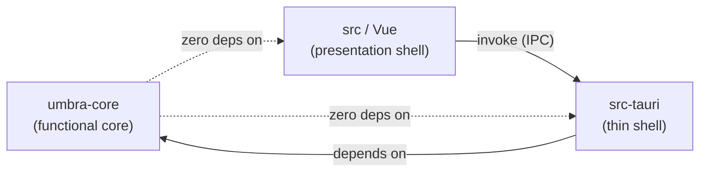

# Umbra — Architecture

> Companion to [`ARCHITECTURE-SPINE.md`](./ARCHITECTURE-SPINE.md), the terse build contract. This document is the prose walkthrough — read it first if you're new to the repo, then use the spine as the source of truth when an `AD` number is cited in a PR or a story. `AD` IDs here match the spine exactly.
>
> Reconstructed 2026-07-20 after the original (2026-07-19) architecture docs were lost in a data-loss incident during scaffolding. Rebuilt from the PRD, `epics.md`, and the surviving Story 1.1 file — see the spine's `sources` frontmatter.

## The big picture

Umbra is a single desktop app, not a client/server system — there is no backend to architect. The whole design problem is: **how do dozens of independent little tools (JSON formatter, Base64, UUID/hash, JWT decoder, NL↔cron, OCR, and more arriving over the school year) stay consistent with each other and with the app's one non-negotiable promise — nothing leaves this machine — without a review bottleneck reading every PR line by line?**

The answer is a **functional core, thin shell** split, borrowed from Gary Bernhardt's pattern:

- **`crates/umbra-core`** — the functional core. Every tool's actual logic (parsing JSON, decoding a JWT, generating a UUID, running OCR) is a pure Rust function or a narrow trait, with zero I/O and zero platform dependency. It is trivially unit-testable and — because it never imports Tauri — automatically stays portable to Windows and Linux, which the PRD (NFR3) wants and which CI proves directly on every PR (AD-11) rather than relying on whichever platform a given contributor happens to develop on day to day.
- **`src-tauri`** — the thin shell. The only place allowed to touch the outside world: reading a dropped file, writing a saved file, talking to the clipboard, checking for updates. It exposes core's functions to the frontend as async commands and does essentially no business logic of its own.
- **`src`** (Vue 3) — the presentation shell. Renders whatever core computed, in a human's timezone and locale. Owns the small amount of state that genuinely needs to live across tools (settings, the tool registry) in two Pinia stores, nothing more.



Why this matters in practice: when Story 2.3 (UUID generation) and Story 4.1 (OCR) are built weeks apart, possibly with different context loaded, this split is what keeps them from drifting into two different error-handling styles, two different ways of talking to the clipboard, or one of them quietly picking up a networking dependency. The 16 `AD`s below are the specific rules that make that split actually hold under pressure, not just in the happy path.

## Cross-platform by construction

NFR3 says macOS is primary but the codebase must stay "cross-platform-clean" — no macOS-only dependency in any core path — because Windows/Linux builds are a stated P3 goal, and the project cannot assume its own development platform stays constant over its lifetime (today it's built on macOS; that could change, or a future contributor could join on Linux or Windows). Two mechanisms enforce this rather than relying on discipline or on whoever happens to be developing at the time:

1. **AD-2**: `umbra-core` may not import Tauri and may not contain a single `#[cfg(target_os)]` branch. This is the crate where an accidental macOS-only call (say, a Vision-framework OCR shortcut) would most tempt someone — and it's exactly the crate that's forbidden from having one.
2. **AD-11**: every PR runs `cargo check`, clippy, **and** `cargo test` on `ubuntu-latest`, `windows-latest`, **and** `macos-latest` — all three, as *required* status checks. These three compile and execute code, and Rust's `#[cfg(target_os = "...")]` means OS-gated code is only compiled (and only tested) on its own platform — `src-tauri`, unlike `umbra-core`, is allowed such code, so skipping any one OS here would leave a real gap. A PR literally cannot merge if it silently broke Linux, Windows, or macOS compilation or tests — this is why the PRD's OCR decision (§9) picked an ONNX runtime over macOS's native Vision framework in the first place.

   `cargo fmt --check`, eslint, and Vitest, by contrast, only read source text — they never compile or execute anything, so their result cannot differ by OS. These run once, on `ubuntu-latest`. The production build (`pnpm build`) also runs once, and deliberately on `ubuntu-latest` rather than macOS: Linux's case-sensitive filesystem catches an import-path casing bug (`import './Foo.vue'` against a file actually named `foo.vue`) that macOS's and Windows's default case-insensitive filesystems would silently let through. *(Amended 2026-07-23, Story 1.4, in two passes: first two runners → three runners so cross-platform proof doesn't depend on any one contributor's local machine; then split by whether a check compiles/executes code or only reads it, rather than bundling everything onto one OS. See the spine's AD-11 for the binding rule.)*

## The `ToolError` contract (AD-3)

Every one of Umbra's tools fails sometimes — malformed JSON, a corrupt image, an expired-looking JWT, a cron phrase nobody could parse. Rather than each tool inventing its own error shape and the frontend growing a pile of tool-specific error-rendering code, there is exactly one error type, defined once in `umbra-core`:

```rust
struct ToolError {
    code: String,           // stable kebab-case, e.g. "json-syntax"
    message: String,        // human-readable
    position: Option<Position>,
    context: Option<String>,
}

#[serde(tag = "kind")]
enum Position {
    LineCol { line: u32, column: u32 },
    ByteOffset(u64),
}
```

Every Tauri command returns `Result<T, ToolError>`. The Vue side has exactly one error-rendering path that reads `code`/`position`/`context` — it never string-matches `message`. This is what lets FR7 (JSON line/col errors), FR18 (JWT segment errors), and FR12 (Base64 byte-offset errors) all reuse the same rendering code instead of each becoming a bespoke UI.

## Performance and responsiveness (AD-4, AD-16)

The PRD's NFR9 bar — a 10MB JSON document must not block the UI for more than ~200ms — and NFR2's cold-launch budget (<2s) both come from the same underlying rule: **nothing expensive runs on the main thread, and nothing expensive runs at launch that doesn't have to.**

- Work that can exceed ~100ms of CPU runs async on Rust's blocking thread pool (AD-4).
- Heavy one-time costs — loading the OCR model into memory — are deferred behind a `OnceCell` until the first time OCR is actually used, guarded so two racing first-uses share one initialization instead of loading the model twice (AD-16).
- Every slow command invocation carries a request ID; if the user edits faster than results come back, only the newest result is applied — a classic "stale response" bug class is closed by convention instead of by every tool remembering to handle it.

## Privacy as an architectural property, not a policy (AD-7)

INV-1 ("no tool, AI feature, or background process initiates network traffic") is the entire reason this app exists, so it's enforced structurally rather than by review vigilance alone:

- The only network-capable dependency anywhere in the tree is `tauri-plugin-updater`.
- The webview's Tauri capabilities grant no network scope — even if a rogue JS dependency wanted to `fetch()`, the sandbox says no.
- OCR models ship *inside* the app bundle (accepting the size cost per NFR2's tolerance for "reasonable and explained") rather than downloading on first use, so there's no first-run network moment to explain away.
- The one disclosed exception — the update check — is disclosed in two places, not one: the README and the app's own Settings/about screen. AD-7 treats shipping only one of those two disclosures as a violation, not a nitpick.

This is also why AD-12 requires every release PR to record an executed network-monitor tour: the promise is *verified per release*, not asserted once and assumed to hold forever.

## Islands, not a monolith (AD-5, AD-6)

Adding tool #20 should not require touching the sidebar, the palette, *and* a router file by hand — that's exactly the kind of three-places-to-update drift this architecture exists to prevent. A tool registers once, in one place (`{ id, name, aliases, route, icon, drop declarations, shortcut declarations }`), and that single entry generates the sidebar, the `⌘K` palette index, and the route table (AD-5).

Tools then behave as islands: no tool reads another tool's internal state (AD-6). The only state allowed to cross tool boundaries lives in two Pinia stores, `settings` and `registry` — anything else is local to the tool that owns it. This is what makes it safe for the P3 cadence (FR35 — one small tool shipped roughly every week or two, Sept→March) to add tools without a growing risk of cross-tool breakage each time.

## Where OS-level things happen (AD-14, AD-15)

File drops, clipboard access, and global keyboard shortcuts are edges where "just let each tool handle it" would produce N slightly-different implementations and N sets of edge-case bugs. Instead the shell owns each of these exactly once:

- One window-level drop listener dispatches to whichever tool is active, using that tool's registry-declared handler — a plain `{ accepted mime types, handler command }` declaration, not a live callback the tool registers itself.
- One clipboard service wraps the Tauri clipboard plugin; `navigator.clipboard` is explicitly forbidden, since it would bypass the service and reintroduce N implementations.
- Pasted images (⌘V into the Bucket) reuse that same registry-declared handler, but arrive via Tauri's raw IPC body rather than a file path — the one sanctioned exception to "files cross IPC as paths" (AD-15), since a clipboard image has no path to send.
- Files otherwise always cross the Rust↔JS boundary as absolute paths, never as raw bytes over JSON IPC (with that one exception above) — `src-tauri` is the only thing that ever opens a file handle; `umbra-core` cannot touch the filesystem at all, which is itself a consequence of AD-2's zero-Tauri-dependency rule.

## The AI-honesty bar (AD-9, AD-13)

The PRD is explicit that "wrong-but-confident output is a bug, not a model limitation" (FR21) — for both the OCR feature and, especially, natural-language-to-cron. A silently-wrong cron expression that ships to production is worse than the tool admitting it couldn't parse the phrase.

AD-9 makes this a build-time guarantee rather than a review-time hope: every NL→cron result is round-tripped through the cron→English direction *before* it's ever shown to the user. If the round-trip doesn't match, the result is suppressed and an honest failure is shown instead. A canonical phrase corpus — must-convert phrases and must-honestly-fail phrases — runs as an automated test in `umbra-core`; a regression in either direction fails CI, not just a manual QA pass.

AD-13 extends the same honesty principle to localization: French support cannot land in the UI alone while OCR and NL→cron still silently assume English underneath — a release adds the language everywhere at once, or it doesn't ship.

## Shipping and updating (AD-12)

Releases are tag-driven end to end: pushing a version tag triggers `tauri-action`, which builds, signs with the Developer ID certificate, notarizes with Apple, and publishes a GitHub Release including the `latest.json` the updater reads. All signing/notarization/updater secrets live only in GitHub Actions — never in the repo, which matters doubly here since the repo is public (All Rights Reserved, NFR7) from day one. The updater's private key gets backed up offline in two places before the very first release ships, since losing it would mean no installed copy could ever update again.

The update-confirmation dialog is deliberately app-built UI rather than the plugin's default — this is the one place a network call is allowed, and it earns an explicit, visible, user-confirmed moment rather than a silent background download.

## What's deliberately not decided yet

A spine's job is to fix only what would actually cause two independently-built pieces to diverge — everything else is better decided later, closer to the code, with more information. The full list lives under the spine's **Deferred** section; the highlights:

- Styling/component framework — no UX design contract exists yet (confirmed 2026-07-20), so plain scoped CSS holds until a UX phase happens.
- The exact OCR ONNX model files — picked and documented when Epic 4 Story 4.1 actually needs them.
- The second AI feature (FR29: regex-explain vs. OCR→structured) — deferred to Epic 6 Story 6.3, decided from evidence the OCR and NL→cron work will have produced by then.
- Windows/Linux packaging — deferred to P3 backlog grooming; AD-11's CI matrix keeps the code ready in the meantime without committing to a ship date now.

## Reading this repo

- Start with `_bmad-output/planning-artifacts/prds/prd-Umbra-2026-07-19/prd.md` for *why* — the product, the users, the demo it has to support.
- `_bmad-output/planning-artifacts/epics.md` for *what, in what order* — epics, stories, acceptance criteria, all citing the `AD` numbers above.
- `ARCHITECTURE-SPINE.md` for *the enforceable rules* — cite an `AD` number in a PR review the same way you'd cite a lint rule.
- This document for *why the rules are shaped this way* — useful context for a code review or an interview conversation, not itself a source of new rules.
